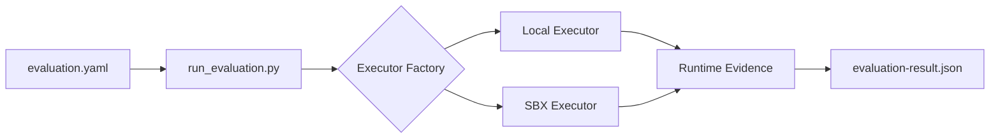

# SBX AI Evaluation Kit

A Docker Sandboxes (SBX) Mixin Kit for building reproducible AI evaluation workflows.

## Motivation

As AI agents become more capable and autonomous, evaluating their behavior consistently becomes increasingly important. Small differences in environment, dependencies, tooling, or local configuration can make evaluation results difficult to reproduce and compare.

This project explores how Docker Sandboxes (SBX) can provide reusable, isolated environments for benchmarking, testing, and evaluating AI agents.

The initial focus is simple: make evaluation workflows more repeatable before tackling more advanced evaluation challenges.

## Goals

- Reproducible AI evaluation environments
- Fixed dependencies for more consistent evaluation runs
- Evaluation-focused agent instructions
- Repeatable baseline vs. candidate workflows
- Clear documentation of observations, failures, and limitations
- Support evaluation workflows informed by AI safety and governance practices

## What This Kit Provides

- Structured evaluation configuration (`evaluation.yaml`)
- Deterministic source provenance
- Optional local or Docker Sandboxes (SBX) command execution
- Machine-readable evaluation artifacts with runtime evidence
- Unit tests
- GitHub Actions CI
- Sample evaluation workflow
- Reproducibility guidance
- Roadmap

## Why Docker Sandboxes?

Running evaluations inside Docker Sandboxes provides stronger isolation and more reproducible execution than relying solely on the host environment.

The SBX executor helps reduce variability caused by differences in local dependencies, tooling, and machine configuration while preserving structured runtime evidence for each evaluation run.

## Architecture



Both executors return the same runtime evidence structure, allowing evaluation artifacts to remain consistent regardless of where commands execute.

## Example Use Cases

- Prompt evaluation
- Baseline vs. candidate comparison
- Agent workflow testing
- Safety evaluation experiments
- Reproducibility testing

## Status

This repository is an executable prototype for reproducible AI evaluation workflows built around Docker Sandboxes (SBX).

The current implementation includes:

- a structured evaluation configuration,
- deterministic source provenance,
- optional local or Docker Sandboxes (SBX) command execution,
- capture of stdout, stderr, exit code, and execution duration,
- pinned dependencies,
- agent-context guidance,
- unit tests,
- a reproducible smoke test,
- and GitHub Actions CI.

The included evaluation is intentionally illustrative and is designed to demonstrate the evaluation workflow. The current workflow can execute a configured command using either the local executor or Docker Sandboxes (SBX) and records the command, stdout, stderr, exit code, and execution duration as runtime evidence. It does not yet execute AI models or automatically derive evaluation judgments.

## Quick Start

Install dependencies:

```bash
python -m pip install -r requirements.txt
```

Run the complete workflow:

```bash
./scripts/smoke-test.sh
```

Or run the steps individually:

```bash
python run_evaluation.py
pytest
```

### Example execution configuration

```yaml
execution:
  executor: sbx
  command:
    - python3
    - -c
    - print("hello from sbx")
```

Produces runtime evidence:

```json
{
  "executor": "sbx",
  "stdout": "hello from sbx\n",
  "stderr": "",
  "exit_code": 0,
  "duration_seconds": 0.12
}
```

This regenerates `evaluation-result.json`, validates the generated artifact, and runs the unit tests.
